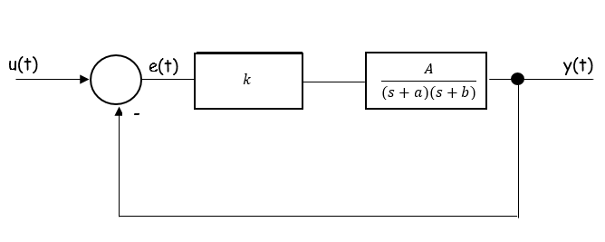

# ControlSystem
C# WPF application created with Visual Studio 2019.

Application can calculate and display a response of second order control system.
There are three possible input signals: sine, rectangular and triangluar wave. There is also possibility to show root locus graph.

Schema of contol system:

  

